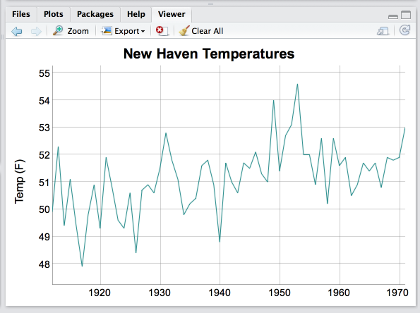

```{r loadpkg, include=FALSE}
library(dygraphs)
```

```{r chunkopts, include = FALSE}
knitr::opts_chunk$set(
  collapse = TRUE,
  comment = "#>"
)
```

## Interactive Sessions

You can use `dygraph` at the R console just like any other plotting function. For example, here's the code used to plot the `nhtemp` time series with R graphics along with the code to plot it using `dygraphs`:

```{r run, eval=FALSE}
plot(nhtemp, main = "New Haven Temperatures", ylab = "Temp (F)")
dygraph(nhtemp, main = "New Haven Temperatures", ylab = "Temp (F)") 
```

In the default R console the dygraph will appear in an external browser window.

If you call `dygraph()` within RStudio then it's output appears within the *Viewer* pane, a special pane dedicated to displaying web content. The Viewer pane works exactly like the Plots pane, and includes history, zoom, and options for exporting it's contents to image files, the clipboard, or standalone HTML. Here's what the output of the previous call looks like in the Viewer pane:



## RMarkdown

You can use dygraphs within [R Markdown](http://rmarkdown.rstudio.com) documents just like any other R plotting function. However, rather than a PNG file being included in your document, the JavaScript required to render your dygraph is included. 

Note that since dygraphs are web-based (they use HTML, CSS, and JavaScript) they can only be included in HTML based R Markdown formats (i.e. they can't be used in PDF or Word documents).

By default, dygraphs that appear within R Markdown documents respect the default figure size of the document. This means that their size will be the same as that of other standard plots.

Figure sizes are specified in inches and can be included as a global option of the document output format. For example:

```
---
title: "My Document"
output:
  html_document:
    fig_width: 6
    fig_height: 4
---
```

You can also specify figure sizes on a per-chunk basis. For example, to create a dygraph that is smaller than the default (7x5) you could do this:

<pre class="r"><code>&#96;&#96;&#96;{r, fig.width=6, fig.height=2.5}
dygraph(nhtemp, main = "New Haven Temperatures", ylab = "Temp (F)") 
&#96;&#96;&#96;
</code></pre>

```{r markdown, echo=FALSE, fig.width=6, fig.height=2.5}
dygraph(nhtemp, main = "New Haven Temperatures", ylab = "Temp (F)") 
```

## Shiny

The dygraphs package provides the `dygraphOutput()` and `renderDygraph()` functions to enable use of `dygraphs` within [Shiny](http://shiny.rstudio.com) applications. These functions work exactly like the `shiny::plotOutput()` and `shiny::renderPlot()` functions. For example, here's a simple Shiny application that uses these functions:

**ui.R**

```r
library(shiny)
library(bslib)
library(dygraphs)

ui <- page_sidebar(
  title = "Predicted Deaths from Lung Disease (UK)",
  sidebar = sidebar(
    numericInput(
      "months",
      label = "Months to Predict",
      value = 72,
      min = 12,
      max = 144,
      step = 12
    ),
    sliderInput(
      "interval",
      label = "Prediction Interval",
      min = 0.8,
      max = 0.99,
      value = 0.95,
      step = 0.01
    ),
    checkboxInput("showgrid", label = "Show Grid", value = TRUE)
  ),
  dygraphOutput("dygraph")
)
```

**server.R**

```r
library(shiny)
library(dygraphs)
library(datasets)

server <- function(input, output) {
  predicted <- reactive({
    hw <- HoltWinters(ldeaths)
    predict(
      hw,
      n.ahead = input$months,
      prediction.interval = TRUE,
      level = input$interval
    )
  })
  output$dygraph <- renderDygraph({
    dygraph(predicted(), main = "Predicted Deaths/Month") %>%
      dySeries(c("lwr", "fit", "upr"), label = "Deaths") %>%
      dyOptions(drawGrid = input$showgrid)
  })
}
```

Two Shiny input bindings are made available by dygraphs to allow dynamic responses to user actions:

1. A `date_window` input binding which responds to changes in the selected/zoomed `dateWindow`.

2. A `click` input binding which responds to mouse clicks and makes available the value on the x-axis that the click corresponds to as well as the closest x,y point to the click.

The names of the input bindings are the shiny ID combined with the name of the input (e.g. `mydygraph_data_window` or `mydygraph_click`). For example, here's another variation of the simple application from above that displays the current from/to range as well as responds to click events:

**ui.R**

```r
library(shiny)
library(bslib)
library(dygraphs)

ui <- page_sidebar(
  title = "Predicted Deaths from Lung Disease (UK)",

  sidebar = sidebar(
    numericInput(
      "months",
      label = "Months to Predict",
      value = 72,
      min = 12,
      max = 144,
      step = 12
    ),
    sliderInput(
      "interval",
      label = "Prediction Interval",
      min = 0.8,
      max = 0.99,
      value = 0.95,
      step = 0.01
    ),
    checkboxInput("showgrid", label = "Show Grid", value = TRUE),
    hr(),
    div(strong("From: "), textOutput("from", inline = TRUE)),
    div(strong("To: "), textOutput("to", inline = TRUE)),
    div(strong("Date clicked: "), textOutput("clicked", inline = TRUE)),
    div(strong("Nearest point clicked: "), textOutput("point", inline = TRUE)),
    br(),
    helpText("Click and drag to zoom in (double click to zoom back out).")
  ),
  dygraphOutput("dygraph")
)
```

**server.R**

```r
library(shiny)
library(dygraphs)
library(datasets)

server <- function(input, output) {
  predicted <- reactive({
    hw <- HoltWinters(ldeaths)
    predict(
      hw,
      n.ahead = input$months,
      prediction.interval = TRUE,
      level = input$interval
    )
  })

  output$dygraph <- renderDygraph({
    dygraph(predicted(), main = "Predicted Deaths/Month") %>%
      dySeries(c("lwr", "fit", "upr"), label = "Deaths") %>%
      dyOptions(drawGrid = input$showgrid)
  })

  output$from <- renderText({
    strftime(req(input$dygraph_date_window[[1]]), "%d %b %Y")
  })

  output$to <- renderText({
    strftime(req(input$dygraph_date_window[[2]]), "%d %b %Y")
  })

  output$clicked <- renderText({
    strftime(req(input$dygraph_click$x), "%d %b %Y")
  })

  output$point <- renderText({
    paste0(
      'X = ',
      strftime(req(input$dygraph_click$x_closest_point), "%d %b %Y"),
      '; Y = ',
      req(input$dygraph_click$y_closest_point)
    )
  })
}
```
